# Three channel parallel analog to digital conversion
## Description
This project is developed and tested with the STM32F429I Discovery Board. The purpose is a three channel analog to digital conversion (ADC). It's realized by the three builtin ADC with a resolution of 12 bit and a sampletime of 480 ADC clock cylces. The total time for a conversion of one signal takes by the configured clocks about 27.3 microseconds. All three ADCs configured in the independent mode, so that each can have a own sample rate. Each ADC runs on a different channel and does a single conversion (see in the following image), triggered by a own timer. 

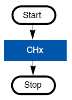

After the system configured successfully and the system is ready for a measurement the green led will be turned on. If an error occurs during the runtime the red led will be turned on. To debug the errors and functionality depending on the configuration, the debug logs can be shown in the Serial Wire Viewer of the ST-Link Utility.

The measurment can be started by pressing the user button for the configured start press duration (default is one second). On start the green led button is turned of. To stop a running measurement, the user button must be pressed for the configured stop press duration.

## Workflow
The workflow of the application is shown in the following flowchart. The main program starts by initializing the HAL-Library and configuring the GPIOs. Before the configuration of the user button GPIO are taken, the clocks gets enabled. After the configuration of the user button, the interrupt for the user button gets activated and the GPIOs for the leds gets configured. Then the system clock gets configured. If an error occurs the red led gets turned on and the program stops the execution. If everything was okay, the user configureable parameters gets checked. Is any of the parameters incorrect the red led gets turned on and the execution is stopped. Otherwise the ADCs and their timers gets configured. Here the same such as in the steps before, the red led gets turned on if an error occurs, otherwise the program execution will continued. After the configuration of the ADCs and the timers the system configuration is finished and the green led will be turned on. At the next step the main while loop gets started, which does nothing than waiting for the configured button interrupt and end of converions interrupts of each ADC.

In the callback function of the GPIO interrupt, firstly the GPIO pin gets checked by which the interrupt was raised. If it was the pin of the user button the state of the button gets checked, otherwise the callback will finish and do nothing more. Was the user button pressed and the state GPIO_PIN_SET the pressure duration in milliseconds is got from the SysTick timer. If the state of the user button is GPIO_PIN_RESET, the button was released. Then the pressure duration gets calculated. Is the time greater than the configured starting time and the measurement isn't running, the measurement gets started by starting the ADCs and their corresponding timers. Also the green led gets turned off. If the measurement is already running and the pressure duration is greather than the stopping time, the measurement gets stopped by stopping the ADCs and their corresponding timers. Also the green led gets turned on. Otherwise nothing will be done.

The end of conversion interrupt callback for the ADCs checks by which ADC the interrupt was raised and saves the newly converted value into the corresponding variable.

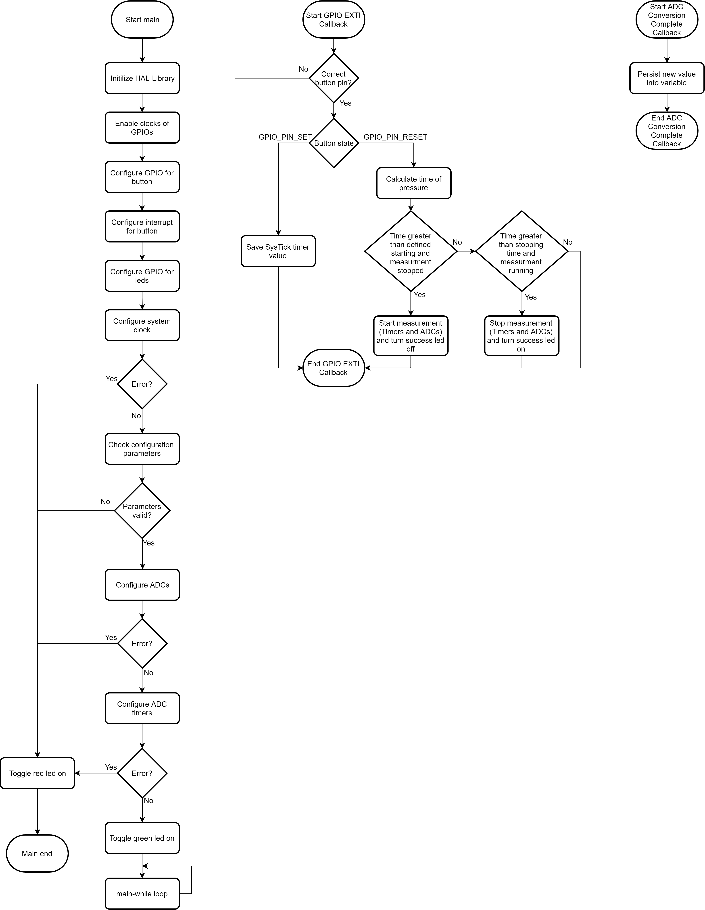

## Configuration
The configurations of the project can be done by adjusting the corresponding preprocessor variables in the file `Inc/configuration.h`. There the debug logs that are putted out via the `printf` function for errors and infos can be enabled by commenting the corresponding defines in or disabled by commentig the corresponding defines out. Also the duration of button press in milliseconds for starting or stopping the measurement can be configured. For each of the three ADCs the sample rate can be configured between at least 1 Hz and a maximum of 36585 Hz. The maximum is limited by the resolution, sampling time and clock rate of the ADCs. The system clock configuration can be obtained from the following graphic.

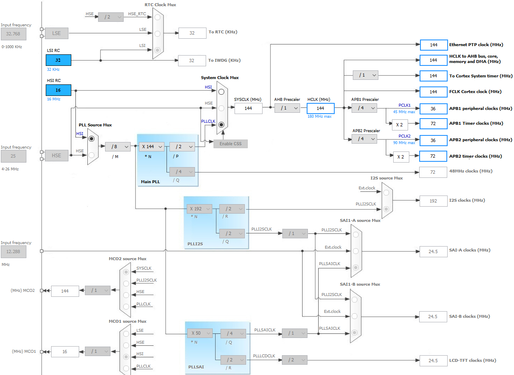

The hardware clock is configured with 144 MHz. The ADCs are connected to the APB1 bus, which is configured with a clock prescaler of 4 and therfore the clock rate of the bus is 144 MHz / 4 = 36 MHz. The ADCs have a clock prescaler of 2. So the clock rate of the ADCs is 36 MHz / 2 = 18 MHz. For a conversion of one signal value the ADCs take 480 cycles sample time and 12 cycles for the 12 bit resolution, finally 492 clock cylces for one single value. So the maximum sample rate is 18000000 Hz / 492 ≈ 36585 Hz.

Also, if desired, the GPIO pins for the user button, success led, error led and input channels of the three ADCs can be configured. The channel for each ADC must be unique from channel 1 to channel 15. The channel 0 can't be used, because this GPIO pin is used for the user button.

Moreover the configuration of the system clock, adcs and their timers can be found in this file, which **shouldn't** be changed. Only if you know what you are doing you can change the values, but keep in mind that the program can stop work, because it is only tested with that system configuration.

## Tests
The tests where executed with the following compiled binaries.

| Name | Testbinary |
| ---- | ---------- |
| Turn on red led on error | Documentation/Tests/Wrong_Configuration_Logs_Enabled.bin |
| Turn on green led on ready | Documentation/Tests/Working_With_Debug_Logs.bin |
| Button switch functionallity | Documentation/Tests/Working_With_Debug_Logs.bin |
| Conversion | Documentation/Tests/Working_With_Debug_Logs.bin |
| Configureable samplerate | Documentation/Tests/Working_With_Debug_Logs.bin |
| Configuration of printf | Documentation/Tests/Working_Without_Debug_Logs.bin and Documentation/Tests/Wrong_Configuration_Error_Logs_Disabled.bin |

### Turn on red led on error

To ensure that the red (error) led is turned on, when an error occurs, a wrong configuration parameter value was specified in the `configuration.h`. After compiling and flashing the program, as expected the red led was turned on.

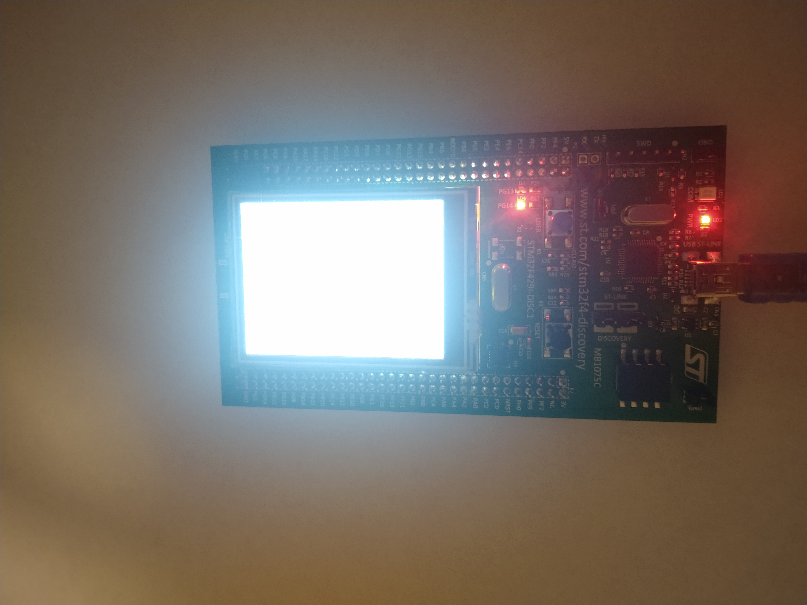

### Turn on green led on ready

To ensure that the green (success) led is turned on, then the system is ready for starting a conversion and it is turned of during the conversion, a break point right before the system was ready was set. On executing until the break point wasn't passed the green led was off.

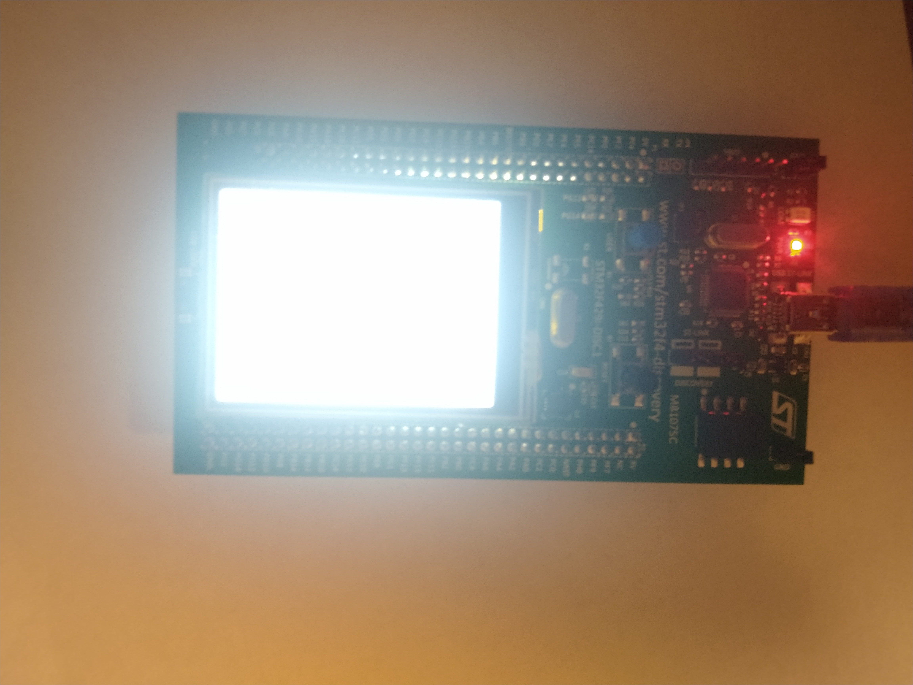

After passing the break point the green led was turned on.

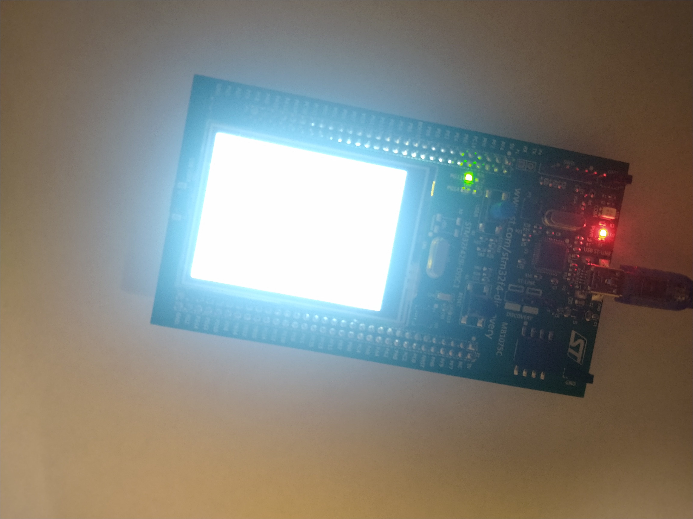

As the next test the conversion was started by pressing the user button for the defined start press duration and as expected the green led was turned off. On conversion stop by pressing the user button for a second time the green led was turned on as expected.

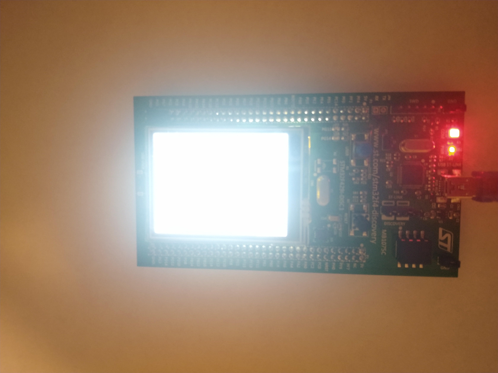

### Button switch functionallity

For the tests of the button switch functionality a counter, a flag and the press duration were saved in variables, which were displayed in the STMStudio. On pressing the button the counter was increased as expected by one. On releasing the user button after the defined press start duration of one second, the conversion was started and the flag was set to `1` as expected.

As next step the user button was pressed for a duration lower than the defined stop press duration of five seconds, the flag doesn't changed it's value and the button press counter was increased by one.

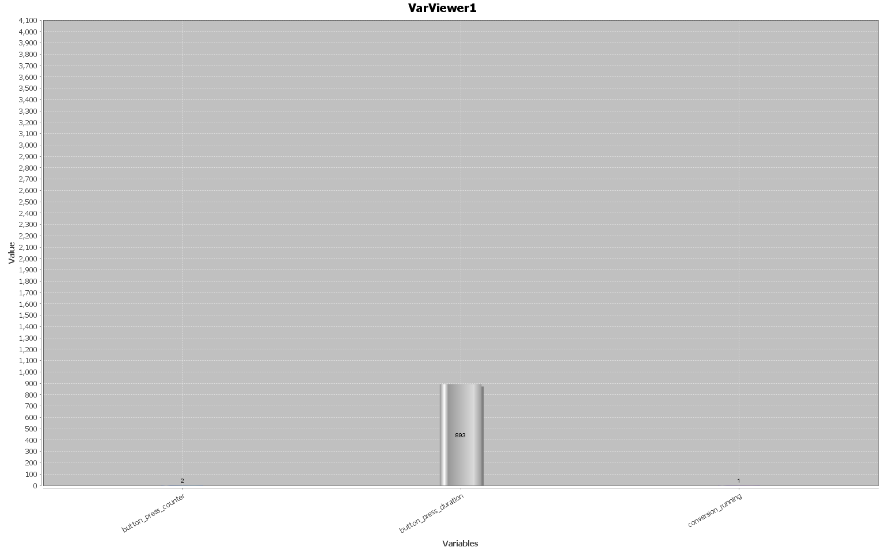

After pressing a third time the user button for a duration longer than five seconds the conversion was stopped, the flag was reset to `0` and the button press counter was increased by one.

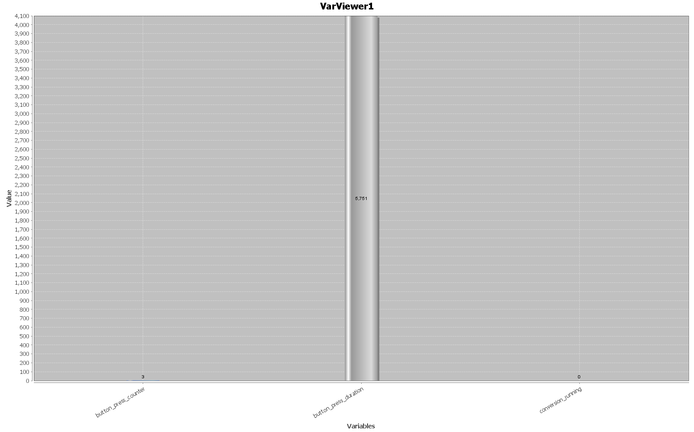

The last test was to press the user button for a duration lower than the start press time. As expected only the button counter was increased and the flag doesn't changed it's value. 

### Conversion

The conversion was simple tested by letting the pins open, by connecting them to a 3V power source and by connecting them all to GND (0V). The variables with the converted values were inspected with the STMStudio. For disconnected pins as expected the values were some where in the possible range, depending on the electromagnetic fields in the near of the pins.

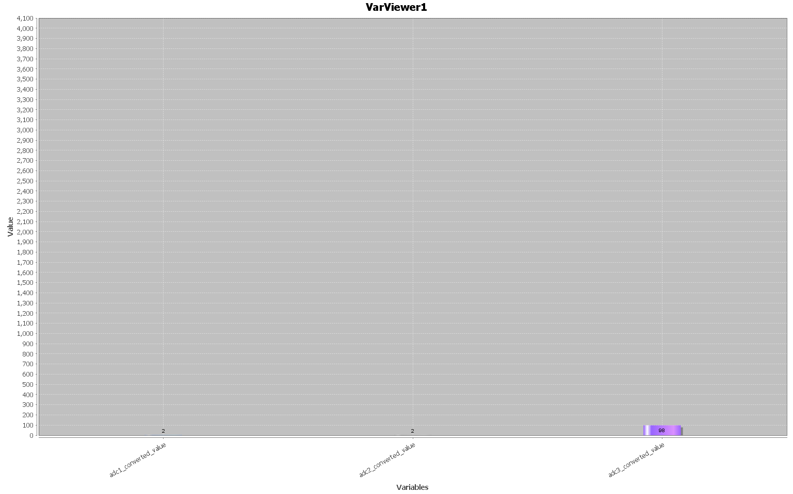

After connecting all pins to 3V the values got the correct digital value around 4096 (2^12).

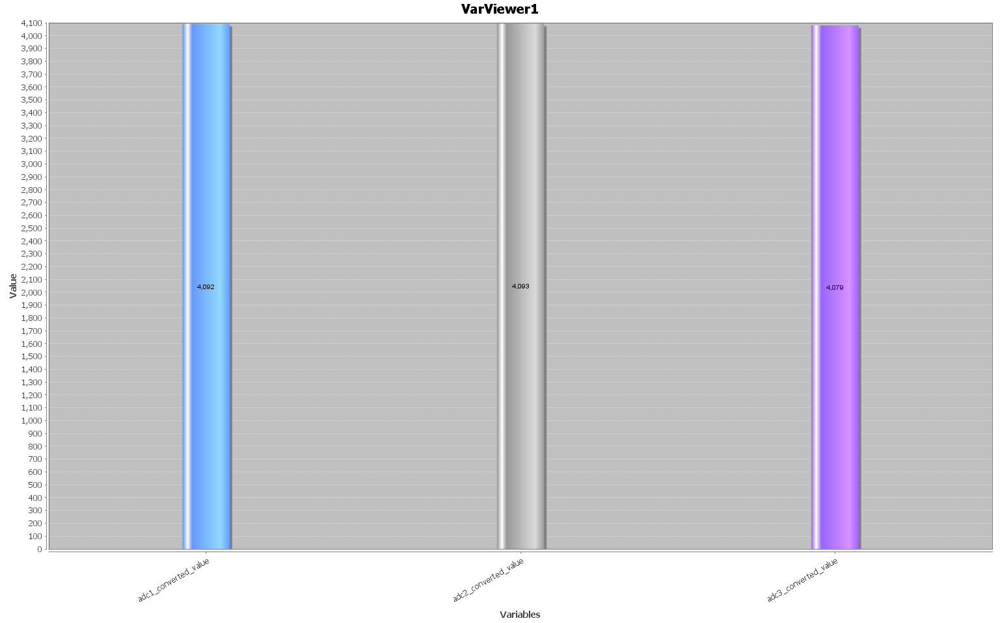

For the pins connected to GND (0V) as expected the variables got digitalized values around 0.

### Configureable samplerate

To check if the samplerate configurability was implemented correctly, the samplerate of all three ADCs was set to 10 Hz. In the EOC-Interrupt callback the time difference in milliseconds between the actual and past interrupt was calculated and stored depending on the ADC which raised the interrupt into the corresponding variable. And as expected the time difference for 10 Hz was 1/10 = 0.1 seconds = 100 milliseconds.

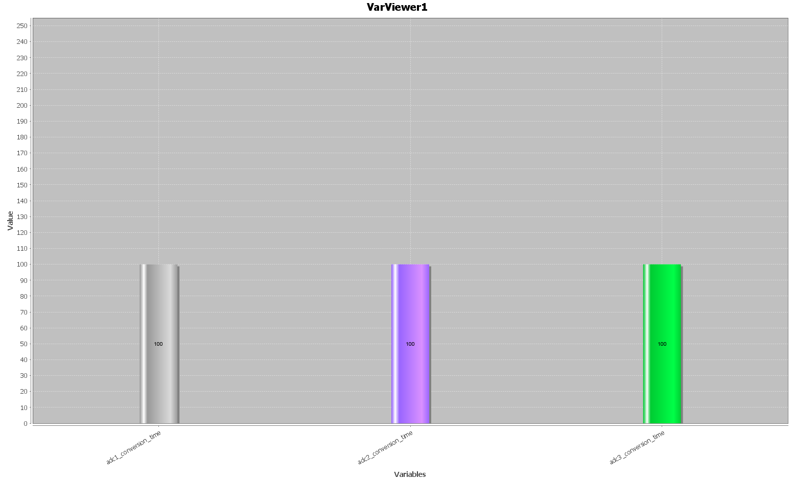

### Configration of printf

The configurability of printf functionality was check by raising an error and viewing the printf output via the Serial Wire Viewer of ST-Link Utility. For all logs enabled (defined macros), the info and error logs were printed to the console as expected.

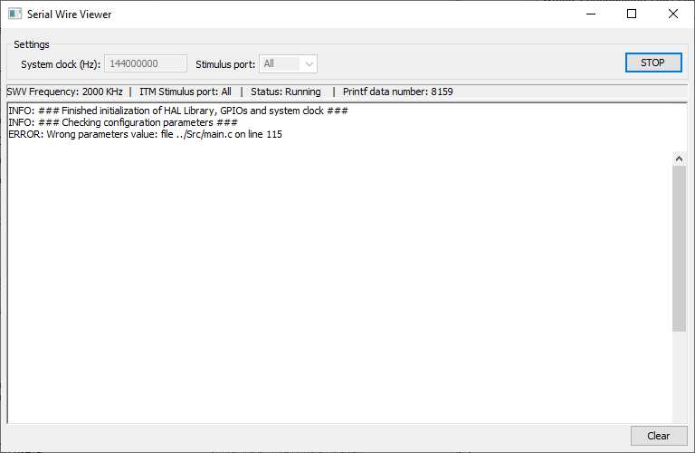

For the second test the error logs were disabled by commenting out the corresponding macro. And as expected the error logs weren't shown in the console.

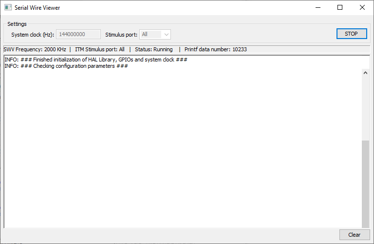

In the last test also the info log macro was commented out and so the info logs were disabled. After that no logs as expected were displayed.

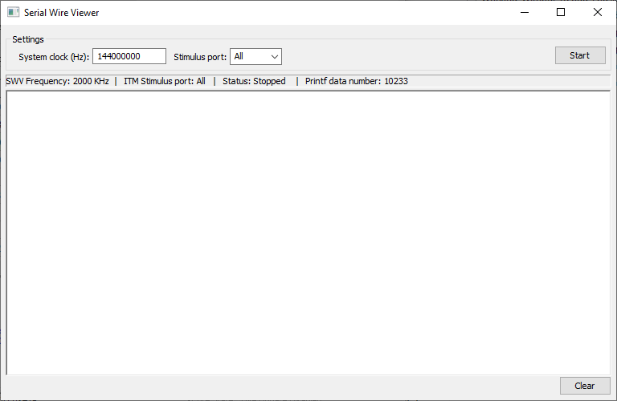
